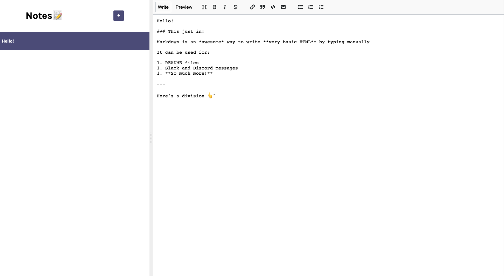

# Notes📝

### This just in!

Notes is an *awesome* way to write your quick thoughts by typing manually

It can be used for:

1. README files
1. Slack and Discord messages
1. **So much more!**

#### Check it live on -> https://kedar-nadh.github.io/Notes/

## Screenshots

